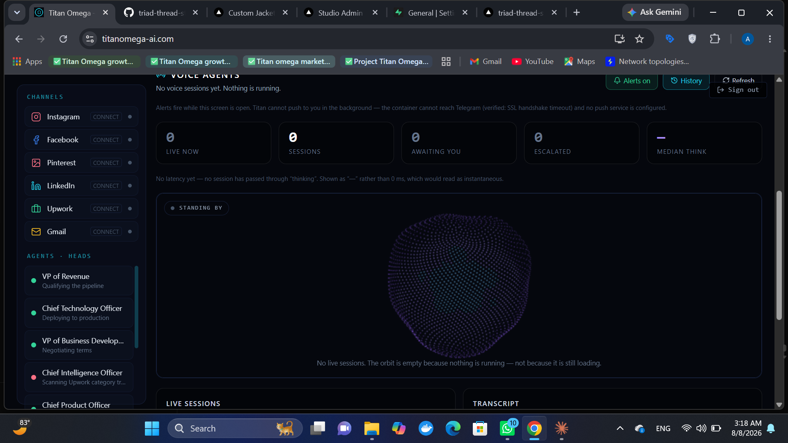

# TITAN Ω

### SEO, local ranking and legal compliance — audited for any business, in any jurisdiction

**Multi-tenant platform with a voice-agent layer. Built solo, on a $0 stack.**

[**titanomega-ai.com**](https://titanomega-ai.com) · [Start free](https://titanomega-ai.com/join) · [Pricing](https://titanomega-ai.com/pricing)

---

## What it does

Add a website. Titan crawls it and returns a technical, local and **legal** audit —
scored separately, never averaged — then a client-ready PDF.

The legal check is the differentiator: **Impressum / §5 DDG, GDPR consent and
cookie disclosure across 9 jurisdictions**. It is a defect a business owner
cannot argue with, and it is included **in full on the free tier** — hiding the
one finding that proves the product's value would sell nothing.

16 verticals, and the distinctions are real: `wholesale` and `manufacturer` are
`local_business=False`, because a B2B buyer finds a supplier by searching the
product, never by proximity.

## The rule the whole codebase is built on

**No number is shown unless it was measured.**

- Cost is `null`, never `$0.00` — a zero under a currency symbol claims a
  measurement nobody took.
- Latency is `null` when nothing passed through `thinking`; `0 ms` would read as
  instantaneous.
- An unaudited site shows *not audited*, never `0` beside a real `58`.
- The signup funnel labels each step by **source**: steps rebuilt from durable
  account state are true for every account ever created; steps that can only
  come from the activity log say so, because a zero there means *not observed*,
  not *never happened*.
- Forecasting **refuses** to project on thin data.

## Voice Agent OS

A validated state machine — `idle · listening · thinking · speaking ·
interrupted · escalated · ended` — that **refuses illegal transitions** with a
409. A dashboard cannot honestly animate a state the agent was never in.

**Sensitive tools block on human approval.** Booking, paying, emailing, calling
and deleting land `pending`; executing one without an approver returns **403**.
Not a convention someone has to remember — a state the store enforces.

Speech reactivity is honest: browsers don't expose synthesized speech to the
audio graph, so while Titan speaks the avatar is driven by real word-boundary
events, and the microphone path is a true FFT. The UI says which is driving.
Faking a waveform would be inventing a measurement.

The particle avatar uses **no 3D library** — plain canvas and arithmetic, so it
adds nothing to the bundle and runs on integrated graphics.

## Analytics without a tracker

Visitor counts are measured in-process: no Google Analytics, no third-party
script, no cookie, no consent banner, no bill.

Privacy is the design constraint, not a footnote — Titan sells legal compliance,
so **visitor IPs are never stored**, only a hash with a salt that rotates every
24 hours. Referrers are reduced to a host. Crawler hits are counted separately
and never folded into human traffic.

That costs accuracy, and the report admits it: unique visitors is a per-day
figure only, so it ships **no conversion percentage** rather than inventing the
denominator.

## Security, found the hard way

A test walks the **real route table** and fails on any endpoint serving real
data to a public demo visitor. It was written after `/api/admin/clients` was
found exposing real client names and contacts to anyone clicking "View the live
demo" — the guard fails *open*, so anything unregistered leaks.

That test has caught four endpoints since.

## Titan audits itself

Every 6 hours, with the same engine it sells, published at `/api/self-seo` —
**currently 94/100, grade A**, up from 58/D. Anyone can claim their SEO tool is
good; a score produced by the code the customer is buying can be checked by the
reader in seconds. If it regresses, that number falls in public.

## Engineering

- **182 tests**, run before every push
- Self-healing AI layer: Groq → Gemini → OpenRouter with live model-catalog
  discovery, so provider retirements can't silence it
- Measured model routing — ranks providers on evidence, reliability over latency
- A reflection loop that actually closes: six slow tasks moved the next plan's
  estimate from 3.5 s to 10.5 s
- One container: Next.js static export served by FastAPI, auto-deployed to
  Hugging Face Spaces behind a free Cloudflare Worker on the custom domain
- PWA — installs on Android, iOS and Windows. $0 versus Apple's $99/yr
- No paid service is a hard dependency; every engine degrades honestly

`Python` `FastAPI` `Next.js 14` `TypeScript` `Tailwind` `react-three-fiber`
`Web Speech API` `Web Audio` `SSE` `Tavily` `Dodo Payments` `Docker`

---

Source is private. Available for AI product and automation work —
**abdullahrathore.va@gmail.com**

