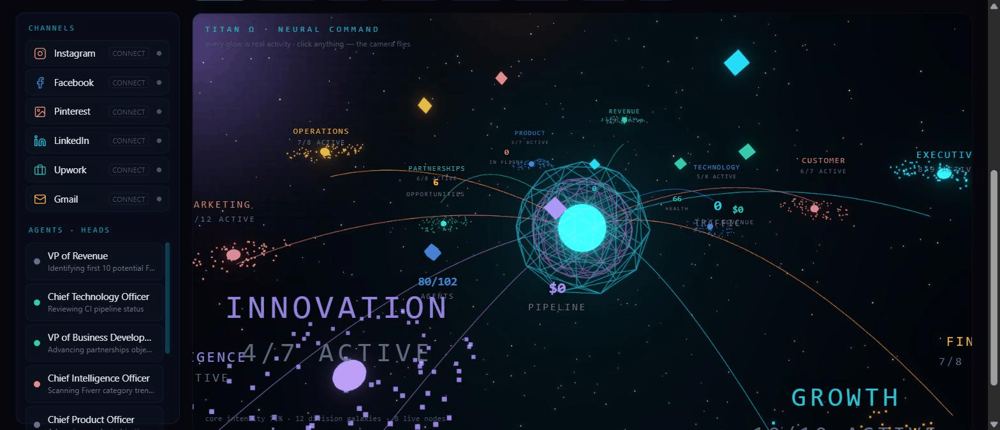
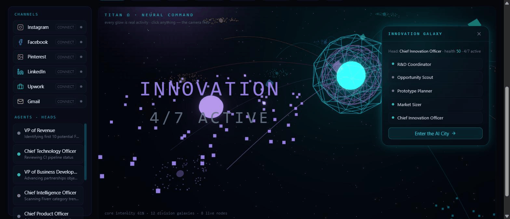
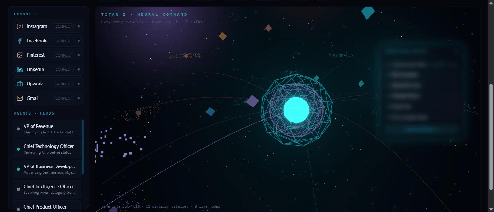

# TITAN Ω

### The Autonomous AI Business Operating System

**Not a dashboard. A living AI command universe that runs a founder's business 24/7.**
Built solo. Zero budget. Every glow you see is real activity.

---

## What is this?

TITAN Ω is a complete AI business operating system: **102 specialized AI agents in 12 autonomous
divisions**, coordinated by an executive intelligence core, presented as a cinematic real-time 3D
"neural command universe" instead of a traditional dashboard.

It researches markets, debates strategy, produces content, hunts jobs, tracks real revenue, and takes
commands from a phone — around the clock.

| | |
|---|---|
|  |  |
| 12 division galaxies orbit the Titan Core — energy streams brighten with live agent activity | Click a galaxy → the camera flies through space and a hologram window opens with its live team |

## Capabilities

- 🌌 **Neural Command Universe** — real-time 3D home; a breathing cinematic camera, division galaxies, floating holographic metrics, comets that fire on real events
- 🎬 **Cinematic boot** — thousands of particles assemble a greeting from light while an AI voice reports systems status, then the camera flies through into the universe
- 🏙 **AI City** — every department is a neon district; fly between them and *talk to any of the 102 agents*, each in character with live task context
- ⚔️ **Agent council** — marketers pitch, a CFO and Risk Officer challenge them, the head decides with a confidence score; every decision is recorded
- 🏭 **Content Factory** — one idea becomes a blog post, LinkedIn post, X thread, Instagram caption, email, and a Shorts script in one click
- 🌍 **Universal voice** — the assistant answers *and speaks* in 12 languages (English, اردو, हिन्दी, العربية, Español, Français, Deutsch, 中文, 日本語, Türkçe, Português, Русский), fronted by a voice-reactive holographic founder
- 📡 **Autonomous growth engine** — live web research around the clock: earning opportunities, competitor moves, SEO keywords
- 💼 **Job Radar** — finds real remote gigs, scores fit 0–100, drafts truthful proposals
- 💰 **Finance + CRM** — real revenue and expense ledgers, honest run-rate forecasts, a leads pipeline, automation-ROI tracking
- 📱 **Telegram command center** — run the whole empire from a phone
- 🤖 **Autonomous code changes** — agents open real, review-gated GitHub pull requests
- 🛡 **Self-healing AI layer** — triple-provider failover with live model-catalog discovery; a model retirement can't silence the system

## More products by the same builder

| Product | What it is | Link |
|---|---|---|
| 🎓 **Career Mind AI** | AI career & education guidance platform for schools — AI Mentor chatbot (local LLMs), OCR grade import, automated PDF reports, GPA analytics, admin dashboard. Live and integrated with TITAN via a real-time connector. | [Live app](https://careermind2026-career-mind.hf.space) |
| 🧰 **AI Job Search Toolkit** | Open-source toolkit applying AI to the job-search workflow. | [GitHub](https://github.com/AbdullahRathoreVA/ai-job-search-toolkit-public) |
| 🏢 **TITAN Ω** | This — the autonomous AI business operating system running both products' growth. | [Live demo](https://careermind2026-project-titan-omega.hf.space) |

## Design principle: honesty

TITAN never fakes a number. Revenue starts at $0 and moves only when real money moves. Forecasts are
labelled run-rates. Progress XP is earned only by real events. Unconnected integrations say "connect"
instead of showing invented data.

## Tech

`Python · FastAPI · SSE` · `Next.js 14 · TypeScript · Tailwind` · `three.js / react-three-fiber + bloom` ·
`framer-motion` · `WebAudio synthesized sound` · `Web Speech (12-language TTS)` · `Telegram Bot API` ·
`Make.com automations` · `Docker → Hugging Face Spaces`

---

## 🚀 [Live demo](https://careermind2026-project-titan-omega.hf.space)

*(The dashboard is the founder's real business cockpit — full access on request.)*

**Source code is private.** Interested in a build like this — AI agents, automation, or a full AI product?

**Muhammad Abdullah Rathore** · AI Integration & Automation Developer
📧 abdullahrathore.va@gmail.com · [GitHub](https://github.com/AbdullahRathoreVA)

